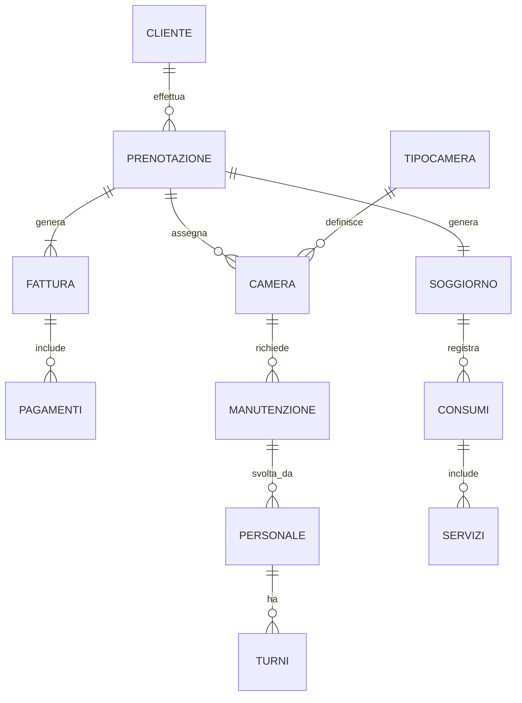

# APPLICAZIONE WEB CON DATABASE

## Indice
- [Introduzione](#introduzione)
- [Analisi dei requisiti](#analisi-dei-requisiti)
- [Diagramma Entità-Relazione](#diagramma-entità-relazione)
- [Schema logico](#schema-logico)
- [Dizionario dei dati](#dizionario-dei-dati)
- [Conclusioni](#conclusioni)

---

## Introduzione

Il presente progetto riguarda la progettazione di un database relazionale per un sistema di gestione di un hotel, da utilizzare come base per un’applicazione web.  
Il sistema è pensato per supportare tutte le principali attività operative di una struttura alberghiera, consentendo una gestione efficiente e integrata di clienti, prenotazioni, camere, servizi, personale, fatturazione e manutenzioni.

La progettazione del database rappresenta la Fase 1 dello sviluppo dell’applicazione e ha l’obiettivo di realizzare una struttura dati affidabile, coerente e facilmente estendibile, rispettando i vincoli reali di un contesto alberghiero, come la gestione delle prenotazioni nel tempo e il controllo dell’occupazione delle camere.

---

## Analisi dei requisiti

### Requisiti funzionali

Il sistema deve consentire di:
- gestire i clienti memorizzandone i dati anagrafici e di contatto;
- gestire le prenotazioni indicando il periodo di soggiorno e lo stato;
- gestire le camere con informazioni su numero, piano, prezzo e disponibilità;
- classificare le camere tramite i tipi di camera;
- gestire il soggiorno effettivo del cliente;
- registrare i servizi offerti dall’hotel;
- tracciare i consumi effettuati durante il soggiorno;
- gestire la fatturazione e i pagamenti;
- gestire il personale e i relativi turni di lavoro;
- gestire la manutenzione delle camere.

### Vincoli di sistema

- Una camera può avere più prenotazioni, ma in periodi diversi;
- Ogni prenotazione è associata a una sola camera;
- Una fattura può essere saldata tramite uno o più pagamenti;
- I dati devono rispettare i vincoli di integrità referenziale;
- Il database deve evitare ridondanze e anomalie di aggiornamento.

---

## Diagramma Entità-Relazione

Il diagramma Entità-Relazione descrive la struttura concettuale del database, evidenziando le entità principali, i loro attributi e le relazioni con le rispettive cardinalità.

Le entità individuate sono:
- Cliente
- Prenotazione
- Camera
- TipoCamera
- Soggiorno
- Servizi
- Consumi
- Fattura
- Pagamenti
- Personale
- Turni
- Manutenzione

Le relazioni modellano il funzionamento reale dell’hotel:
- Un cliente può effettuare più prenotazioni;
- Una prenotazione genera un soggiorno;
- Una camera appartiene a un solo tipo di camera;
- Durante il soggiorno vengono registrati i consumi dei servizi;
- Una prenotazione genera una fattura;
- Una fattura può essere pagata con più pagamenti;
- Il personale svolge turni di lavoro e interventi di manutenzione.

Il diagramma ER è rappresentato tramite codice Mermaid.

---

## Schema logico

A partire dal diagramma Entità-Relazione è stato progettato lo **schema logico relazionale**, convertendo ogni entità in una tabella del database e implementando le relazioni mediante **chiavi primarie** e **chiavi esterne**.

La tabella **Cliente** contiene i dati anagrafici dei clienti ed è collegata alla tabella **Prenotazione** tramite una relazione uno-a-molti, poiché un cliente può effettuare più prenotazioni nel tempo, mentre ogni prenotazione è associata a un solo cliente.

Le **Camere** sono gestite dalla tabella *Camera*, che memorizza le informazioni strutturali e di stato. Ogni camera appartiene a un solo **TipoCamera**, mentre un tipo di camera può essere associato a più camere, evitando ridondanze e semplificando la gestione delle caratteristiche comuni.

La tabella **Prenotazione** rappresenta la richiesta di soggiorno del cliente ed è collegata alla tabella **Camera** con una relazione uno-a-molti: una camera può essere prenotata più volte in periodi diversi, mentre ogni prenotazione fa riferimento a una sola camera. Sono previsti vincoli temporali sulle date per garantire la correttezza del periodo di prenotazione.

Per distinguere la fase di prenotazione dalla permanenza effettiva del cliente in hotel, è stata introdotta la tabella **Soggiorno**, collegata alla tabella Prenotazione tramite una relazione uno-a-uno. Questo permette una gestione più accurata del soggiorno reale.

I **Servizi** offerti dall’hotel sono memorizzati in una tabella dedicata, mentre i **Consumi** rappresentano l’utilizzo effettivo dei servizi durante il soggiorno. La relazione tra Servizi e Consumi è di tipo uno-a-molti: un servizio può essere utilizzato più volte, mentre ogni consumo è riferito a un singolo servizio e a un singolo soggiorno.

La gestione economica è realizzata tramite le tabelle **Fattura** e **Pagamenti**. Ogni prenotazione genera una sola fattura (relazione uno-a-uno), mentre una fattura può essere saldata tramite uno o più pagamenti, consentendo la gestione di pagamenti parziali o rateizzati.

Il **Personale** dell’hotel è gestito tramite una tabella dedicata ed è collegato alla tabella **Turni** con una relazione uno-a-molti, poiché ogni dipendente può svolgere più turni di lavoro. Sono inoltre previsti vincoli temporali per garantire la coerenza delle date.

Infine, la tabella **Manutenzione** consente di registrare gli interventi effettuati sulle camere. Ogni intervento di manutenzione è associato sia a una **Camera** sia a un membro del **Personale**, garantendo la tracciabilità delle operazioni svolte.

---

## Dizionario dei dati

### Tabella Cliente
- **codF**: codice fiscale del cliente  
- **nome**: nome del cliente  
- **cognome**: cognome del cliente  
- **telefono**: numero di telefono  
- **email**: indirizzo email  

### Tabella TipoCamera
- **codTipoC**: codice del tipo di camera  
- **tipo**: tipologia della camera (singola, doppia, suite, familiare)  
- **postiL**: numero di posti letto  

### Tabella Camera
- **codC**: codice della camera  
- **nC**: numero della camera  
- **piano**: piano in cui si trova la camera  
- **stato**: stato della camera  
- **prezzo**: prezzo base  
- **codTipoC**: chiave esterna verso TipoCamera  

### Tabella Prenotazione
- **codP**: codice della prenotazione  
- **dataInizio**: data di inizio soggiorno  
- **dataFine**: data di fine soggiorno  
- **stato**: stato della prenotazione  
- **codF**: chiave esterna verso Cliente  
- **codC**: chiave esterna verso Camera  

### Tabella Soggiorno
- **codS**: codice del soggiorno  
- **dataIn**: data di inizio soggiorno  
- **dataFi**: data di fine soggiorno  
- **codP**: chiave esterna verso Prenotazione  

### Tabella Servizi
- **codServ**: codice del servizio  
- **tipo**: tipo di servizio offerto  

### Tabella Consumi
- **codCon**: codice del consumo  
- **data**: data del consumo  
- **quantita**: quantità consumata  
- **prezzo**: prezzo del consumo  
- **codServ**: chiave esterna verso Servizi  
- **codS**: chiave esterna verso Soggiorno  

### Tabella Fattura
- **codFattura**: codice della fattura  
- **totale**: importo totale  
- **codP**: chiave esterna verso Prenotazione  

### Tabella Pagamenti
- **codPag**: codice del pagamento  
- **tipo**: modalità di pagamento  
- **codFattura**: chiave esterna verso Fattura  

---

## Conclusioni

La realizzazione del database per la gestione di un hotel ha permesso di creare un modello chiaro e ben organizzato, in linea con i requisiti richiesti. Il diagramma entità-relazione e lo schema logico consentono di gestire correttamente clienti, prenotazioni, camere e servizi, assicurando ordine e coerenza nei dati.
Questo progetto rappresenta una buona base per un eventuale sviluppo futuro, come la creazione di un’interfaccia per l’utilizzo del sistema.
